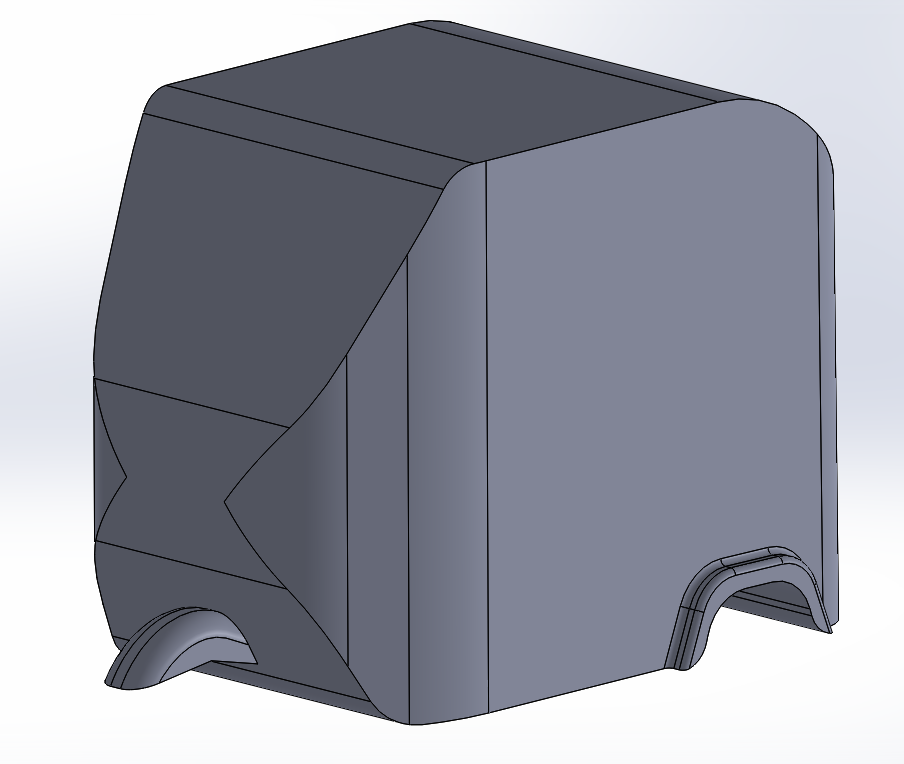
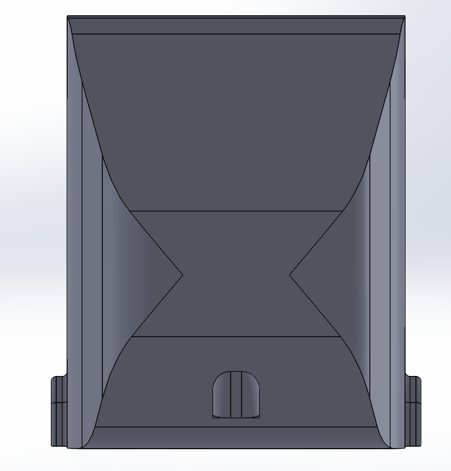
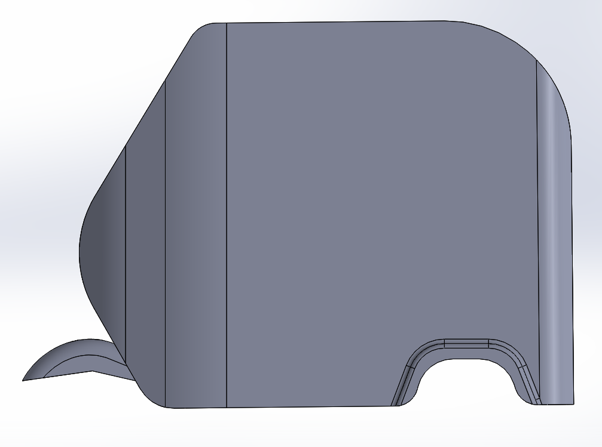
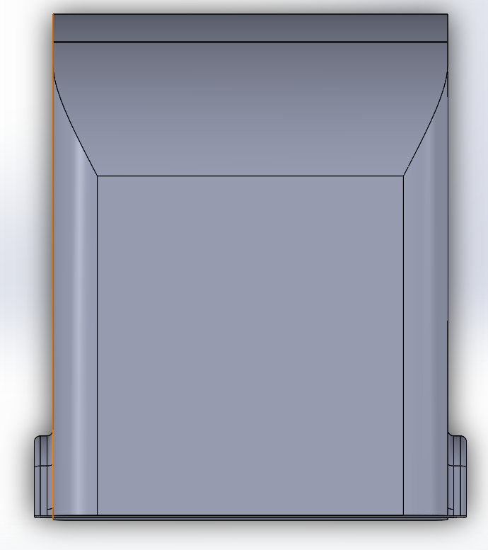

# CAD Models

This folder contains the computer-aided design (CAD) models developed for the CityHybrid project.

## Contents

### simplified_vehicle_model.STEP

A simplified external geometry of the three-wheeler used for aerodynamic analysis.

## Purpose

The model was created specifically for Computational Fluid Dynamics (CFD) simulations to estimate the aerodynamic drag characteristics of the vehicle.

To reduce computational cost and meshing complexity, several geometric details were intentionally omitted, including:

* Wheels
* Mirrors
* Suspension components
* Interior features
* Small external protrusions

The resulting geometry represents the primary external body shape required for preliminary aerodynamic analysis.

## CAD Model Preview

### Isometric View

### Front View

### Side View

### Rear View

## Software

The model was developed in SolidWorks and exported in STEP format for use in ANSYS Fluent.

## Model Assumptions

* Simplified external geometry.
* No wheel assemblies included.
* No mirrors or auxiliary aerodynamic features included.
* Intended for preliminary aerodynamic studies only.

## File Information

| File                          | Description                                   |
| ----------------------------- | --------------------------------------------- |
| simplified_vehicle_model.STEP | Simplified CAD geometry used for CFD analysis |

## Notes

* This model is intended for CFD analysis only.
* It should not be considered a manufacturing-ready or dimensionally complete vehicle model.
* The calculated drag coefficient obtained using this simplified geometry is expected to underestimate the drag of a real vehicle due to the omission of secondary aerodynamic features.
