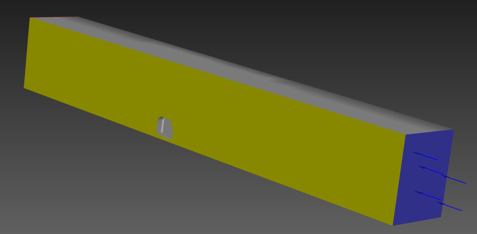

# CFD Analysis

This folder contains the Computational Fluid Dynamics (CFD) analysis performed for the CityHybrid project.

## Objective

The purpose of this analysis is to estimate the aerodynamic performance of a simplified three-wheeler body and evaluate the effect of aerodynamic drag on vehicle energy consumption.

## Software

* ANSYS Workbench
* ANSYS Fluent

## Analysis Description

A simplified CAD model of the three-wheeler was imported into ANSYS and enclosed within a computational fluid domain for external flow simulation.

The analysis was performed to determine:

* Aerodynamic drag force
* Drag coefficient (Cd)
* Flow field characteristics around the vehicle

## Files

| File            | Description                                        |
| --------------- | -------------------------------------------------- |
| drag_sim.wbpj   | ANSYS Workbench project file                       |
| drag_sim_files/ | Associated ANSYS project files and simulation data |

## Simulation Assumptions

* Steady-state external flow
* Air treated as an incompressible fluid
* Simplified vehicle geometry
* Wheels and mirrors omitted

## Key Results

| Parameter             | Value   |
| --------------------- | ------- |
| Drag Coefficient (Cd) | 0.357   |
| Drag Force            | 43.79 N |

A Drag Coefficient of 0.4 was taken for the calcualtions to consider the effects of the omitted vehicle geometry components.

## Results and Visualizations

### Computational Domain

### Velocity Contours

### Pressure Contours

## Notes

The current analysis is intended for preliminary aerodynamic assessment and conceptual design purposes. The reported drag coefficient is expected to differ from that of a production vehicle due to geometry simplifications.
