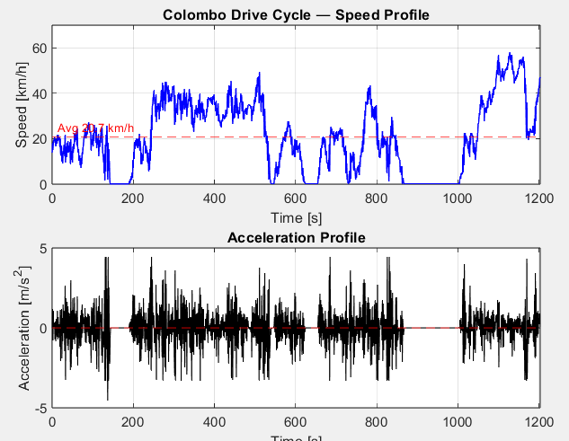

# MATLAB Scripts

This folder contains MATLAB scripts developed for the CityHybrid project.

## Purpose

The scripts in this directory are used for vehicle parameter calculations and drive cycle analysis required for the conceptual design and evaluation of the hybrid powertrain system.

## Scripts

### vehicle_params.m

Calculates and stores the key vehicle parameters used throughout the project.

Typical parameters include:

* Vehicle mass
* Wheel radius
* Frontal area
* Aerodynamic drag coefficient
* Rolling resistance coefficient
* Air density
* Drivetrain parameters

This script serves as a centralized source for vehicle data used in subsequent simulations and calculations.

---

### colombo_drive_cycle.m

Processes and visualizes the Colombo drive cycle dataset.

The script is used to:

* Import drive cycle data
* Verify dataset integrity
* Plot vehicle speed versus time
* Generate drive cycle profiles for further analysis
* Prepare inputs for energy consumption and powertrain calculations

## Workflow

The MATLAB workflow currently consists of:

1. Define vehicle parameters using `vehicle_params.m`
2. Import and process drive cycle data using `colombo_drive_cycle.m`
3. Use the resulting parameters and drive cycle for vehicle performance analysis

## Generated Outputs

The scripts may generate:

* Speed-time plots
* Acceleration profile
* Vehicle parameter datasets

## Results and Visualizations

### Colombo Drive Cycle

## Notes

The scripts are intended to support the conceptual design and analysis of the hybrid three-wheeler. Additional scripts and functions will be added as the project progresses.
